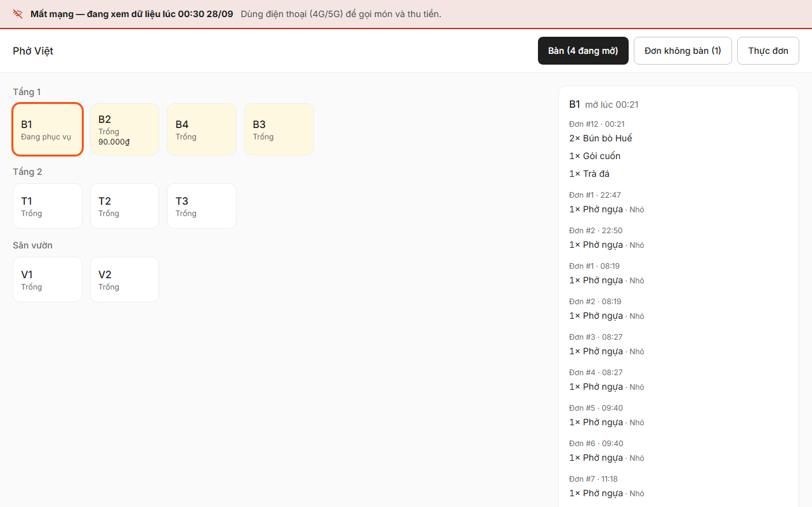
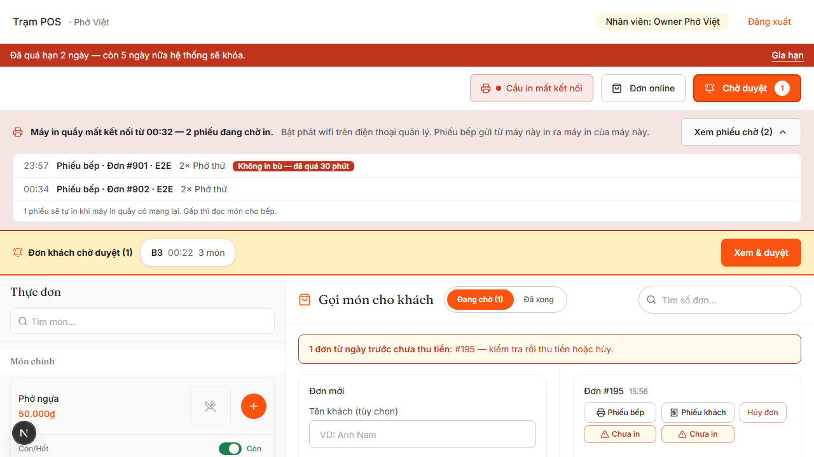

# Hướng dẫn THU NGÂN (máy quầy)

**Đầu ca:** mở lối tắt **POS** trên Desktop → "Email" + "PIN / mật khẩu" của **chính bạn** → **Đăng nhập**.
Góc trên hiện "Nhân viên: <tên bạn>". Hết ca → **Đăng xuất** để người sau đăng nhập tên của họ.

## Việc hằng ngày

| Việc | Làm thế nào |
|---|---|
| Khách vào bàn, gọi món | Chạm bàn trên sơ đồ → chạm món ở **Thực đơn** (ghi chú: "ít cay…") → **Xác nhận thêm N món · <tiền>** |
| In phiếu bếp | Nút **Phiếu bếp** trên đơn. Quán dùng cầu in thì phiếu tự ra ở bếp |
| Khách tự gọi bằng QR | Nút **Chờ duyệt** (chuông kêu) → **Duyệt**, hoặc **Từ chối** kèm lý do |
| Đơn phục vụ gửi từ điện thoại | Băng đỏ **"Đơn cần in phiếu (N)"** → chạm từng đơn để in phiếu bếp |
| Bàn gọi nhân viên | Băng **"Bàn đang gọi"** → đi tới bàn → chạm tên bàn để tắt |
| Tính tiền | **Tính tiền** → kiểm hóa đơn → **Thu tiền** → **Tiền mặt** (nhập "Khách đưa", máy tính "Tiền trả lại") hoặc **Chuyển khoản** → **Xác nhận thu · đóng bill** → **In hóa đơn** |
| Giảm giá | Trong hóa đơn: **Điều chỉnh** → Số tiền hoặc % → **Lưu** (có thể phải nhập PIN quản lý) |
| Tách / gộp | **Tách bill** (theo món / theo đơn / chia đều) · **Gộp bàn** |
| Hủy món đã gửi bếp | **Hủy** cạnh món → chọn người duyệt + PIN → ghi **lý do** → **Xác nhận hủy** |
| Bán mang về | Ô **Bán mang về** → món → **Tạo đơn mang về** → khi khách lấy: **Thu tiền & hoàn tất** |
| Đơn online / đặt bàn | Nút **Đơn online** và **Đặt bàn** trên thanh công cụ |

### Khách chuyển khoản bằng mã QR trên hóa đơn (PAY-03)

Chỉ có khi chủ quán đã khai **tài khoản nhận** ở Cài đặt. Hóa đơn **chưa thanh toán** in ra có mã QR ngay dưới dòng **TỔNG**.

1. **In hóa đơn TRƯỚC khi thu tiền** (bill còn mở) → đưa khách.
2. Khách quét QR bằng app ngân hàng → số tiền và nội dung (`HD<số bill> <ngàytháng>`) tự điền → khách chuyển.
3. Loa / app ngân hàng của quán báo tiền về, **đúng số tiền** → **Thu tiền** → **Chuyển khoản** → **Xác nhận thu · đóng bill**.
4. Khách trả tiền mặt thì bỏ qua QR, thu như cũ.

- **Thêm món / đổi giảm giá sau khi đã in → in lại hóa đơn**: tờ cũ mang số tiền cũ.
- Hóa đơn in **sau** khi đã đóng bill thì **không** có QR (tránh khách chuyển hai lần) — muốn khách quét thì in trước, thu sau.
- Chưa thấy loa báo tiền về thì **chưa** bấm Chuyển khoản. Hệ thống không tự biết tiền đã về.

Hệ thống ghi nhận 2 cách thu: **Tiền mặt** và **Chuyển khoản**. Chưa có mục **Thẻ** — khách quẹt thẻ thì làm
theo cách quản lý quán đã dặn (hỏi trước khi vào ca).

## Khi quán mất mạng (wifi / Internet quán đứt)

Máy quầy mất mạng thì **chỉ xem được** — gọi món và thu tiền chuyển sang **điện thoại 4G/5G** (POS trên điện thoại
có đủ mọi việc của máy quầy).

1. POS máy quầy hiện dòng đỏ **"Mất mạng từ HH:mm — máy này chỉ xem được…"**. Tải lại trang cũng **không trắng
   màn**: máy tự chuyển sang màn **xem lúc mất mạng** (bàn nào đang ăn gì, tổng hóa đơn, thực đơn — dữ liệu lúc
   mất mạng, có ghi giờ). Nút gọi món / thu tiền bị khóa.
2. **Cầm điện thoại** (tắt wifi trên điện thoại nếu nó bám wifi quán đã chết) → mở POS → làm như thường.
3. Báo **quản lý bật phát wifi** (điểm phát cá nhân) trên điện thoại quản lý. Máy quầy tự nối vào đó trong khoảng
   1 phút → phiếu bếp lại ra ở bếp, các phiếu đã gửi trong lúc mất mạng (dưới 30 phút) **tự in bù**.
4. Trong lúc chờ, mọi máy thấy băng đỏ **"Máy in quầy mất kết nối từ HH:mm — N phiếu đang chờ in"**. Bấm
   **Xem phiếu chờ** để thấy phiếu nào (bàn, giờ, món). Phiếu ghi **"Không in bù — đã quá 30 phút"** thì tự **đọc
   món cho bếp** — phiếu đó sẽ không ra giấy nữa.
5. Có mạng lại: băng đỏ tự tắt; màn xem lúc mất mạng hiện nút **Quay lại POS**.

## 3 lỗi hay gặp

1. **Băng đỏ "Máy in quầy mất kết nối"** → xem mục *Khi quán mất mạng* ở trên. Mạng quán vẫn tốt mà băng
   vẫn đỏ → máy quầy tắt / cầu in không chạy: báo quản lý. Phiếu bếp bấm từ **chính máy quầy** vẫn in ra máy
   in của máy quầy — mang vào bếp.
2. **"Bếp chưa nhận — in lại"** trên một đơn → bấm vào chip đó để in lại. Kiểm máy in bếp còn giấy, còn điện.
3. **Bấm in mà hiện hộp thoại chọn máy in** → bạn đang mở POS bằng Chrome thường. Đóng lại, mở bằng lối tắt **POS**.
